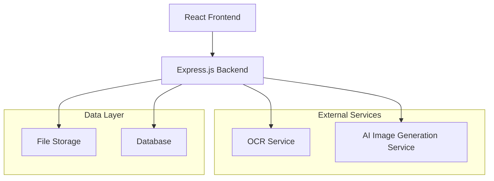

# Design Document

## Overview

The AI Menu Generator is a web application that transforms menu images into visual dish representations through a three-stage pipeline: image upload and preprocessing, OCR text extraction and parsing, and AI-powered dish image generation. The system is designed as a modern single-page application with a React frontend and Node.js backend, utilizing cloud-based AI services for OCR and image generation capabilities.

**Key Design Decisions:**
- **Three-stage pipeline approach**: Separates concerns and allows for independent optimization of each processing stage
- **Session-based processing**: Enables users to return to results and supports manual corrections without losing progress
- **Progressive feedback**: Provides immediate upload feedback and progress indicators to meet the 10-second OCR requirement and user experience expectations
- **Batch processing with queuing**: Optimizes AI API usage while handling rate limits gracefully
- **Manual correction capability**: Addresses OCR ambiguity issues by allowing user intervention when automatic text extraction fails

## Architecture

The application follows a client-server architecture with clear separation of concerns:



### Frontend Architecture
- **React SPA**: Modern component-based UI with hooks for state management
- **File Upload Component**: Drag-and-drop interface with preview capabilities and immediate feedback
- **Results Display**: Grid/card layout for generated dish images with zoom functionality and save/share options
- **Progress Tracking**: Real-time updates during processing stages with estimated wait times
- **Manual Correction Interface**: Allows users to edit extracted menu items when OCR results are ambiguous

### Backend Architecture
- **Express.js API**: RESTful endpoints for file upload, processing, and results
- **Processing Pipeline**: Orchestrates OCR → parsing → image generation workflow
- **Queue System**: Manages batch processing and rate limiting
- **Error Handling**: Comprehensive error recovery and user feedback

## Components and Interfaces

### Core Components

#### 1. Image Upload Handler
```typescript
interface ImageUploadHandler {
  validateFile(file: File): ValidationResult;
  uploadToStorage(file: File): Promise<string>;
  preprocessImage(imageUrl: string): Promise<ProcessedImage>;
}
```

#### 2. OCR Text Extractor
```typescript
interface OCRExtractor {
  extractText(imageUrl: string): Promise<ExtractedText>;
  parseMenuItems(text: string): Promise<MenuItem[]>;
  suggestImageQualityImprovements(error: OCRError): string[];
}

interface MenuItem {
  id: string;
  name: string;
  description: string;
  price: string;
  category?: string;
  isManuallyEdited?: boolean;
}

interface ExtractedText {
  rawText: string;
  confidence: number;
  processingTime: number;
}
```

#### 3. AI Image Generator
```typescript
interface ImageGenerator {
  generateDishImage(menuItem: MenuItem): Promise<GeneratedImage>;
  batchGenerate(items: MenuItem[]): Promise<GeneratedImage[]>;
}

interface GeneratedImage {
  url: string;
  menuItemId: string;
  status: 'success' | 'failed';
  errorMessage?: string;
}
```

#### 4. Results Manager
```typescript
interface ResultsManager {
  saveResults(sessionId: string, results: ProcessingResult): Promise<void>;
  getResults(sessionId: string): Promise<ProcessingResult>;
}

interface ProcessingResult {
  originalImage: string;
  extractedItems: MenuItem[];
  generatedImages: GeneratedImage[];
  processingStatus: ProcessingStatus;
}
```

### API Endpoints

- `POST /api/upload` - Upload menu image with validation
- `GET /api/process/:sessionId` - Get processing status with progress indicators
- `GET /api/results/:sessionId` - Retrieve final results with generated images
- `POST /api/regenerate` - Regenerate specific dish images
- `PUT /api/items/:sessionId` - Manual correction of extracted menu items
- `POST /api/share/:sessionId/:itemId` - Generate shareable links for dish images
- `GET /api/health` - System health check

## Data Models

### Database Schema

#### Sessions Table
```sql
CREATE TABLE sessions (
  id VARCHAR(36) PRIMARY KEY,
  original_image_url VARCHAR(500) NOT NULL,
  status ENUM('uploading', 'processing', 'completed', 'failed') DEFAULT 'uploading',
  created_at TIMESTAMP DEFAULT CURRENT_TIMESTAMP,
  updated_at TIMESTAMP DEFAULT CURRENT_TIMESTAMP ON UPDATE CURRENT_TIMESTAMP
);
```

#### Menu Items Table
```sql
CREATE TABLE menu_items (
  id VARCHAR(36) PRIMARY KEY,
  session_id VARCHAR(36) NOT NULL,
  name VARCHAR(200) NOT NULL,
  description TEXT,
  price VARCHAR(50),
  category VARCHAR(100),
  generated_image_url VARCHAR(500),
  generation_status ENUM('pending', 'generating', 'completed', 'failed') DEFAULT 'pending',
  is_manually_edited BOOLEAN DEFAULT FALSE,
  FOREIGN KEY (session_id) REFERENCES sessions(id) ON DELETE CASCADE
);
```

### File Storage Structure
```
/uploads/
  /{sessionId}/
    /original/
      menu-image.jpg
    /generated/
      dish-{itemId}.jpg
```

## Error Handling

### Error Categories and Responses

#### 1. File Upload Errors
- **Invalid file format**: Return 400 with supported formats list
- **File too large**: Return 413 with size limit information
- **Upload failure**: Return 500 with retry instructions

#### 2. OCR Processing Errors
- **Text extraction failure**: Fallback to manual text input option
- **No menu items detected**: Provide image quality guidelines
- **API rate limits**: Queue request with estimated wait time

#### 3. Image Generation Errors
- **API failures**: Show placeholder image with retry option
- **Content policy violations**: Generate alternative prompt
- **Rate limiting**: Batch processing with progress updates

#### 4. System Errors
- **Database connectivity**: Graceful degradation with local storage
- **External service outages**: Clear error messages with status updates
- **Network connectivity loss**: Allow users to retry operations
- **Memory/performance issues**: Request queuing and load balancing

### Error Recovery Strategies

```typescript
interface ErrorRecoveryStrategy {
  retryWithBackoff(operation: () => Promise<any>, maxRetries: number): Promise<any>;
  fallbackToAlternativeService(primaryService: string): Promise<ServiceProvider>;
  gracefulDegradation(feature: string): AlternativeImplementation;
}
```

## Testing Strategy

### Unit Testing
- **Component Testing**: React components with Jest and React Testing Library
- **Service Testing**: OCR and image generation service mocks
- **Utility Testing**: File validation, text parsing, and error handling functions

### Integration Testing
- **API Testing**: End-to-end API workflows with test databases
- **External Service Testing**: Mock external OCR and AI services
- **File Upload Testing**: Various file formats and sizes

### End-to-End Testing
- **User Journey Testing**: Complete workflow from upload to results
- **Error Scenario Testing**: Network failures, service outages, invalid inputs
- **Performance Testing**: Large files, batch processing, concurrent users

### Test Data Strategy
- **Sample Menu Images**: Various cuisines, layouts, and image qualities
- **Mock API Responses**: Consistent test data for external services
- **Error Simulation**: Controlled failure scenarios for resilience testing

## Performance Considerations

### Performance Requirements
- **OCR Processing**: Complete text extraction within 10 seconds for typical menu images
- **Upload Feedback**: Provide immediate feedback and progress indicators during file uploads
- **Progressive Loading**: Load generated images progressively to improve perceived performance
- **Wait Time Estimation**: Display estimated wait times when system is busy
- **Batch Progress**: Show progress indicators for batch image generation operations

### Frontend Optimization
- **Lazy Loading**: Progressive image loading for results display
- **Caching**: Browser caching for generated images and API responses
- **Compression**: Image optimization for faster uploads and display

### Backend Optimization
- **Queue Management**: Redis-based job queue for processing pipeline
- **Batch Processing**: Optimize AI API calls with batch requests
- **Caching Layer**: Cache OCR results and frequently generated images

### Scalability Design
- **Horizontal Scaling**: Stateless API design for load balancing
- **Database Optimization**: Indexed queries and connection pooling
- **CDN Integration**: Static asset delivery and image hosting

## Security Considerations

### Data Protection
- **File Validation**: Strict file type and size validation
- **Input Sanitization**: Clean extracted text before processing
- **Temporary Storage**: Automatic cleanup of uploaded files

### API Security
- **Rate Limiting**: Prevent abuse of expensive AI operations
- **Authentication**: Session-based access control for results
- **CORS Configuration**: Restrict cross-origin requests appropriately

### Privacy Measures
- **Data Retention**: Automatic deletion of user data after 24 hours
- **Logging**: No sensitive data in application logs
- **External Services**: Ensure AI providers don't retain user data